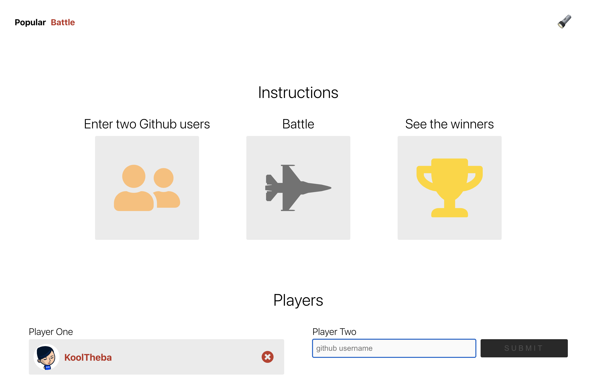
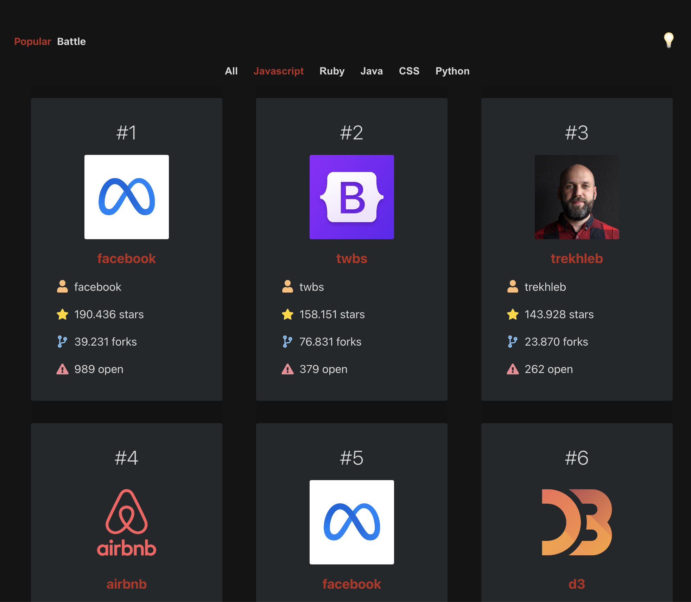

# post-github-battle-react-project
🌈 Here's the one-and-only GitHub User's Battle 🥊 made with React 💅 classes, React Router and others...and ready to be refactored with Hooks 🪝!

<br>
    <p>
        
    </p>
</br>

👉 BUT NOT ONLY THAT!! Check the most popular 🦄 repos on GitHub of each language 😛 in the POPULAR section

<br>
    <p>
        
    </p>
</br>

# Up and Running! 🚀

1.  **Clone this repository.**

    ```sh
    git clone https://github.com/KoolTheba/post-github-battle-react-project.git
    ```

2.  **Start developing.**

    Navigate into your new site’s directory, install dependencies and start it up:

    ```sh
    cd post-github-battle-react-project
    npm install
    npm run start
    ```

3.  **Running!**

    Your site is now running at `http://localhost:3000` 🚀


# Dependencies
- React
- React Router
- ...and tons of love 💜

# Deployment
I've deployed my app pretty easily with 💚 [Netlify](https://app.netlify.com/)

# Scripts

In the project directory, you can run:

#### `npm start`

Runs the app in the development mode.
<br />
Open [http://localhost:3000](http://localhost:3000) to view it in the browser.

# Just wanna play? 🎠

1. Visit the app live 👉 https://kooltheba-github-battle-react.netlify.app/
2. Click on Battle and follow the steps
3. ..and see the results of the Github Battle!

<p align="center">
  
</p>

# Wanna check the most popular repos?
1. Visit the app live 👉 https://kooltheba-github-battle-react.netlify.app/
2. By default you're on the Popular section
3. Click on you favorite language and enjoy the list of the most popular repos!!

<p align="center">
  
</p>

# What's next
For the next or upcoming releases:
- Refactor to React Hooks
- Add tests
- ....anything that can be make it prettier and cooler! 💅